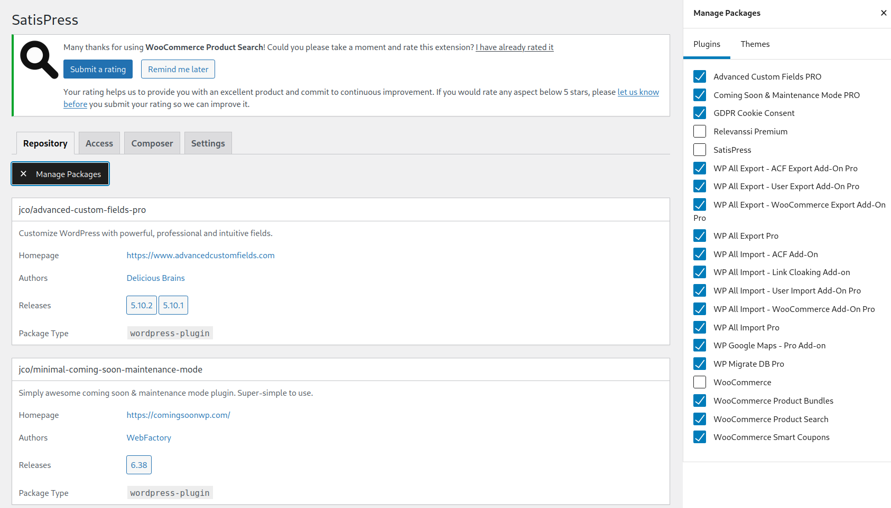
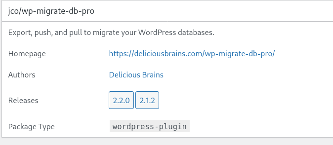

# Plugin handling with Composer
Composer [documentation](https://getcomposer.org/doc/)

CLI [documentation](https://getcomposer.org/doc/03-cli.md)

## When to use
Plugins should be handled by Composer in projects that are complex enough that it is better to lock down plugins to certain versions and not allow installing/updating plugins in the back-end.

## How to use

### Turning on usage of composer plugins in project
change `PLUGIN_INSTALL="remote"` to `PLUTIN_INSTALL="composer"` and add `- wp-content/plugins` to `source:`under the `deploy`section.

### Turning off usage of composer plugins in project
change `PLUGIN_INSTALL="composer"` to `PLUTIN_INSTALL="remote"` and remove `- wp-content/plugins` from `source:`under the `deploy`section.

### Locking plugin installation in backend

To lock the installation of plugins from the backend you have to ask WP Engine support to set the constant DISALLOW_FILE_MODS to true in wp-config. php

### Installing
<https://getcomposer.org/doc/03-cli.md#require>
### Wordpress repo
Free plugins that are found on the wordpress plugins site can be installed by finding the plugin on the site eg. <https://wordpress.org/plugins/wp-google-maps/>. To install the plugin you type:

`composer require wpackagist-plugin/wp-google-maps`

### JCO repo
Plugins that do not exist on the official plugins site can be installed by installing them to the JCO repo site <https://repo.jco.fi/> Activating automatic updates for the plugin is a good idea so that we get a library of the plugin versions.

Then you go to settings/satispress

There you click Manage Packages and tick the box for the plugin you want to use. All the ticked boxes are available to use so make sure not to untick any plugins unless you are sure they are not in use in any project.

Once you have ticked the box you can find the plugin in the list to the left. The command you use to install the plugin in composer is the line at the top of the box. In this picture it is `jco/wp-migrate-db-pro`

The install command is:

`composer require jco/wp-migrate-db-pro`

### Installing local plugins
Plugins can be installed locally by adding them to “require-dev” in composer.json or by adding the –dev flag when running composer require.

## Version control
Package versions can be defined in composer.json.

`jco/advanced-custom-fields-pro": "^5.10.2"` means it has to be over 5.10.2.  
`jco/advanced-custom-fields-pro": "5.10.2"` means exactly version 5.10.2

## Updates
<https://getcomposer.org/doc/03-cli.md#update-u>

Check for updates with command: `composer outdated`

Update specific plugin with `composer update “package to update”` eg. `composer update wpackagist-plugin/wp-google-maps`

Update all packages with command: `composer update`

Note that major updates will not be installed with update eg. 5.10 will not update to 6 but will update to 5.12. To perform major updates you have to change the first number in composer json

## Removing
<https://getcomposer.org/doc/03-cli.md#remove>

To remove a plugin run `composer remove vendor/package`
eg. `composer remove jco/wp-migrate-db-pro`